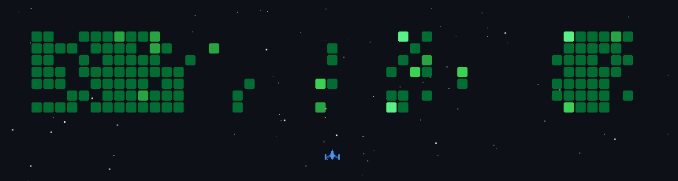

  

  

  <strong>🚀 Full-Stack & Mobile Developer</strong> 
  <em>Building Scalable Apps, Smart Platforms & Digital Experiences</em>

  
  &nbsp;
  
  
  

---

### 👨‍💻 About Me

I'm a passionate developer who enjoys transforming ideas into real-world digital products. I focus on building clean, scalable, and user-focused applications across web and mobile.

🔭 &nbsp;Currently building **MSRA – Smart Tourism & Marketing Platform**  
🌱 &nbsp;Learning & growing in **Advanced Frontend, Mobile, and AI**  
🎯 &nbsp;Goal: Build products that **solve real problems** and **feel great to use**

---

### 🧠 What I Build

| 📱 Mobile Apps | 🌐 Web Apps | 🖥 Backend APIs | 🤖 AI Features | 🎨 UI/UX |
|:-:|:-:|:-:|:-:|:-:|
| Flutter | React · Tailwind · TypeScript | Node.js · Express | ML · Recommendations | Design-Driven Experiences |

---

### 🛠 Tech Stack

<table>
  <tr>
    <td align="center" width="160"><strong>Languages</strong></td>
    <td>
      
      &nbsp;
      
      &nbsp;
      
      &nbsp;
      
      &nbsp;
      
      &nbsp;
      
    </td>
  </tr>
  <tr>
    <td align="center"><strong>Frontend</strong></td>
    <td>
      
      &nbsp;
      
      &nbsp;
      
      &nbsp;
      
    </td>
  </tr>
  <tr>
    <td align="center"><strong>Backend</strong></td>
    <td>
      
      &nbsp;
      
    </td>
  </tr>
  <tr>
    <td align="center"><strong>Mobile</strong></td>
    <td>
      
      &nbsp;
      
    </td>
  </tr>
  <tr>
    <td align="center"><strong>AI / Data</strong></td>
    <td>
      
      &nbsp;
      
      &nbsp;
      
    </td>
  </tr>
  <tr>
    <td align="center"><strong>DB & Tools</strong></td>
    <td>
      
      &nbsp;
      
      &nbsp;
      
      &nbsp;
      
      &nbsp;
      
    </td>
  </tr>
</table>

---

### 📊 GitHub Stats

  

  
  &nbsp;&nbsp;
  

  

---

  <em>⚡ I love blending <strong>design + code</strong> to build products that are not just functional — but memorable.</em>

