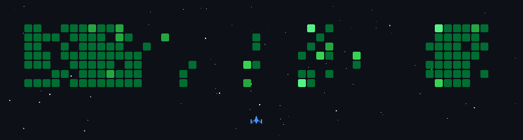
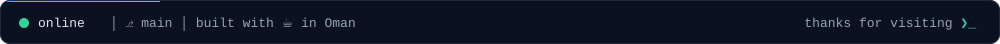

<!-- ============ HEADER ============ -->
<p align="center">
  
</p>

<p align="center">
  
</p>

<p align="center">
  <a href="https://sulaiman.msra.om"></a>
  <a href="https://www.linkedin.com/in/sulaiman-alfarsi-844019287/"></a>
  <a href="mailto:sulaimanalfarsi26@gmail.com"></a>
</p>

<p align="center">
  
  
  
</p>

<p align="center">
  
</p>

<!-- ============ ABOUT ============ -->
## 👨‍💻 About Me

```yaml
name:        Sulaiman Al-Farsi
based_in:    Muscat, Oman 🇴🇲
education:   BTech Software Engineering
currently:   Java Spring Boot training — Tamayuz Program @ Codeline
focus:       [Backend Systems, REST APIs, AI Automation, Data, Scalable Architecture]
achievement: 🏆 Winner — Second Annual Student-Led Startup Forum 2026 (with MSRA)
motto:       "Building backend systems, AI-driven workflows, and useful digital products."
```

<!-- ============ PROJECTS ============ -->
## 🚀 Featured Projects

<table>
  <tr>
    <td width="50%" valign="top">
      <h3>🧭 <a href="https://msra.om/">MSRA</a></h3>
      <p>AI-powered tourism platform for smart travel experiences and tourism marketing in Oman. 🏆 Startup Forum 2026 winner.</p>
      
      
      <br/><br/>
      <a href="https://msra.om/"></a>
    </td>
    <td width="50%" valign="top">
      <h3>🎨 <a href="https://riwaq-art.vercel.app/">Riwaq Art</a> <sup>NEW</sup></h3>
      <p>Bilingual (English / Arabic) digital art gallery where culture meets digital creativity — curated collections and the stories behind each piece.</p>
      
      
      <br/><br/>
      <a href="https://riwaq-art.vercel.app/"></a>
    </td>
  </tr>
  <tr>
    <td width="50%" valign="top">
      <h3>🌸 <a href="https://www.athrist.com/">Athrist Parfums</a> <sup>NEW</sup></h3>
      <p>Online storefront for a handcrafted luxury perfume house — product showcase, brand story, and shipping & refund flows.</p>
      
      
      <br/><br/>
      <a href="https://www.athrist.com/"></a>
    </td>
    <td width="50%" valign="top">
      <h3>🪙 <a href="https://oman-gold-api.vercel.app/">Oman Gold API</a></h3>
      <p>Real-time gold pricing API and dashboard with database integration.</p>
      
      
      <br/><br/>
      <a href="https://oman-gold-api.vercel.app/"></a>
    </td>
  </tr>
  <tr>
    <td width="50%" valign="top">
      <h3>🎟️ <a href="https://unitedom.net/">UnitedOM</a></h3>
      <p>Event management and experiences platform.</p>
      
      <br/><br/>
      <a href="https://unitedom.net/"></a>
    </td>
    <td width="50%" valign="top">
      <h3>🛡️ <a href="https://www.tickingthreat.com/">TickingThreat</a></h3>
      <p>Cybersecurity awareness platform for interactive security education.</p>
      
      <br/><br/>
      <a href="https://www.tickingthreat.com/"></a>
    </td>
  </tr>
</table>

<!-- ============ TECH STACK ============ -->
## 🛠️ Tech Stack

**Languages**
<p>
  
</p>

**Frontend & Mobile**
<p>
  
  <br/>
  
  
</p>

**Backend & Databases**
<p>
  
</p>

**Tools, Design & AI**
<p>
  
  <br/>
  
  
  
</p>

<!-- ============ STATS ============ -->
## 📊 GitHub Stats

<p align="center">
  
</p>

<p align="center">
  
  
</p>

<p align="center">
  
</p>

<!-- ============ ACTIVITY ============ -->
## ⚡ Recent Activity

<!--START_SECTION:activity-->
1. ⬆️ Pushed to `main` on [SulaimanAlfarsi/Oracle-EBS](https://github.com/SulaimanAlfarsi/Oracle-EBS) — <sub>1d ago</sub>
2. ⭐ Starred [abi/screenshot-to-code](https://github.com/abi/screenshot-to-code) — <sub>6d ago</sub>
3. ⭐ Starred [google-ai-edge/mediapipe](https://github.com/google-ai-edge/mediapipe) — <sub>10d ago</sub>
4. ⬆️ Pushed to `main` on [SulaimanAlfarsi/oman-gold-api](https://github.com/SulaimanAlfarsi/oman-gold-api) — <sub>18d ago</sub>
5. 🔀 Opened PR [#38](https://github.com/CodelineAtyab/AgileOraclesEvalutaionArea/pull/38) in [CodelineAtyab/AgileOraclesEvalutaionArea](https://github.com/CodelineAtyab/AgileOraclesEvalutaionArea) — <sub>22d ago</sub>
6. 🔍 Reviewed PR [#798](https://github.com/CodelineAtyab/AgileOraclesExperimentProject/pull/798) in [CodelineAtyab/AgileOraclesExperimentProject](https://github.com/CodelineAtyab/AgileOraclesExperimentProject) — <sub>23d ago</sub>
7. ⬆️ Pushed to `task/86eyn5d8m` on [CodelineAtyab/AgileOraclesExperimentProject](https://github.com/CodelineAtyab/AgileOraclesExperimentProject) — <sub>24d ago</sub>
8. ⬆️ Pushed to `main` on [CodelineAtyab/AgileOraclesExperimentProject](https://github.com/CodelineAtyab/AgileOraclesExperimentProject) — <sub>24d ago</sub>
<!--END_SECTION:activity-->

<!-- ============ FOOTER ============ -->
<p align="center">
  
</p>
